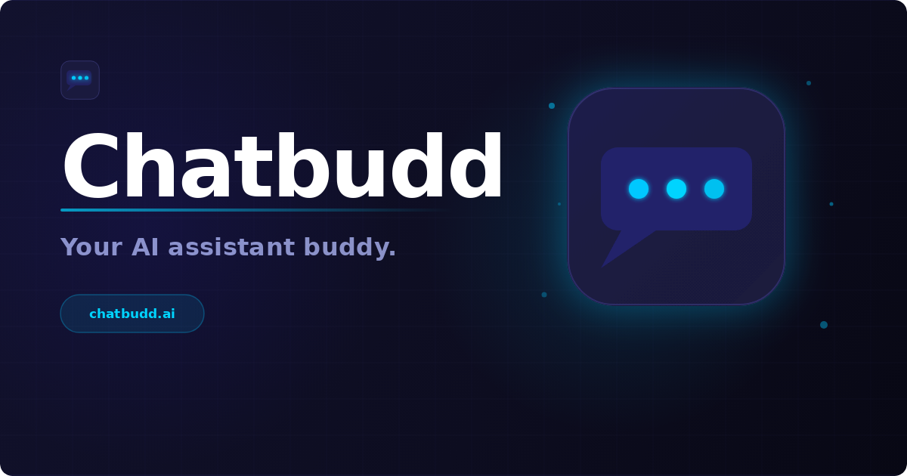

# Chatbudd



> Your AI assistant buddy for thoughtful answers, coding help, research, and everyday tasks.

[](https://your-chatbudd.vercel.app)
[](https://github.com/kevincabanilla/ai-chatbot)
[](https://github.com/kevincabanilla/ai-chatbot/issues)

[](https://github.com/kevincabanilla/ai-chatbot/blob/main/LICENSE)
[](https://react.dev/)
[](https://www.typescriptlang.org/)
[](https://vite.dev/)
[](https://groq.com/)
[](https://vercel.com/)

## Overview

Chatbudd is a full-stack AI chat application built with React, TypeScript, Vite, and Vercel serverless functions. It uses Groq's OpenAI-compatible API for fast responses and keeps conversation state in the browser, making chats easy to revisit without introducing a database.

## Features

- Persistent conversation history backed by `localStorage`
- Shareable conversation URLs using the `?c=` query parameter
- Search across existing conversations
- General and Coding assistant modes
- Runtime model discovery from the Groq Models API
- Configurable model, token limit, and response temperature
- Responsive desktop and mobile navigation
- Structured API validation and user-facing error handling
- SEO, Open Graph, Twitter Card, and WebApplication metadata

## Tech Stack

| Area       | Tools                                                 |
| ---------- | ----------------------------------------------------- |
| Frontend   | React 19, TypeScript, React Router, SWR               |
| Build      | Vite 8, Tailwind CSS 4, TypeScript project references |
| UI         | Lucide React, Motion, class-variance-authority        |
| API        | Vercel Functions, Axios, Groq OpenAI-compatible API   |
| Storage    | Browser `localStorage`                                |
| Deployment | Vercel                                                |

## Quick Start

### Prerequisites

- Node.js 20 or newer
- npm
- A [Groq API key](https://console.groq.com/keys)

### Install and run

```bash
git clone https://github.com/kevincabanilla/ai-chatbot.git
cd ai-chatbot
npm install
cp .env .env.local
npm run dev
```

Open [http://localhost:3000](http://localhost:3000) in your browser. On Windows PowerShell, use `Copy-Item .env .env.local` instead of `cp`. Add your `GROQ_API_KEY` to the local env file before testing chat responses.

> This repository currently includes `.env` as a local reference. Do not commit real credentials. Create or update your own ignored local env file before running the API.

## Environment Variables

The client-side `VITE_*` values are exposed to the browser, so never put secrets in them. `GROQ_API_KEY` is read only by the server-side API functions.

| Variable                | Required        | Purpose                                | Example                            |
| ----------------------- | --------------- | -------------------------------------- | ---------------------------------- |
| `GROQ_API_KEY`          | Yes             | Authenticates requests to Groq         | `gsk_...`                          |
| `VITE_BASE_URL`         | Yes for deploys | Canonical site and social metadata URL | `https://your-chatbudd.vercel.app` |
| `VITE_DEFAULT_AI_MODEL` | No              | Default model for new conversations    | `openai/gpt-oss-120b`              |
| `GROQ_MAX_TOKENS`       | No              | Maximum response tokens                | `1000`                             |
| `GROQ_CHAT_TEMPERATURE` | No              | Response sampling temperature          | `0.7`                              |
| `VITE_APP_TITLE`        | No              | Browser and Open Graph title           | `Chatbudd`                         |
| `VITE_APP_DESCRIPTION`  | No              | SEO description                        | `Your AI assistant buddy.`         |

For local development, use `VITE_BASE_URL=http://localhost:3000`. The checked-in production configuration currently points to `https://your-chatbudd.vercel.app`; update that value when the deployment domain changes.

## Scripts

| Command              | Description                                                          |
| -------------------- | -------------------------------------------------------------------- |
| `npm run dev`        | Start the Vite development server                                    |
| `npm run dev:vercel` | Run the Vite app and Vercel Functions through Vercel's local runtime |
| `npm run build`      | Type-check and create a production build                             |
| `npm run preview`    | Preview the production build locally                                 |
| `npm run lint`       | Run ESLint across the repository                                     |

## API Surface

The frontend talks to two same-origin serverless endpoints:

- `POST /api/chat` accepts `{ messages, model?, skill? }` and returns `{ message }`. Requests are validated and limited to 50 messages.
- `GET /api/models` returns active models from Groq for the settings model picker.

The server injects the selected skill instructions from `server/data/skills.json` and forwards requests to Groq. Keep `GROQ_API_KEY` server-side in Vercel project environment variables.

## Project Structure

```text
api/                  Vercel API function entry points
server/               Groq service, validation, handlers, and server types
shared/               Types and AI skill definitions shared by client and server
src/                  React app, routes, components, state, and API clients
public/               Static assets, including the social preview image
```

## Deploying to Vercel

1. Import the repository into Vercel. The project is already configured for Vite in `vercel.json`.
2. Add `GROQ_API_KEY` under the project's Environment Variables.
3. Set `VITE_BASE_URL` to the public deployment URL, such as `https://your-chatbudd.vercel.app`.
4. Optionally set the model and response tuning variables listed above.
5. Deploy by running `vercel` (preview) or `vercel --prod`. Vercel will build with `npm run build` and expose the functions under `/api`.

## Contributing

1. Create a feature branch.
2. Make the smallest focused change that solves the problem.
3. Run `npm run lint` and `npm run build` before opening a pull request.
4. Include a clear description and screenshots for user-facing changes.

## License

Chatbudd is available under the [MIT License](LICENSE).
